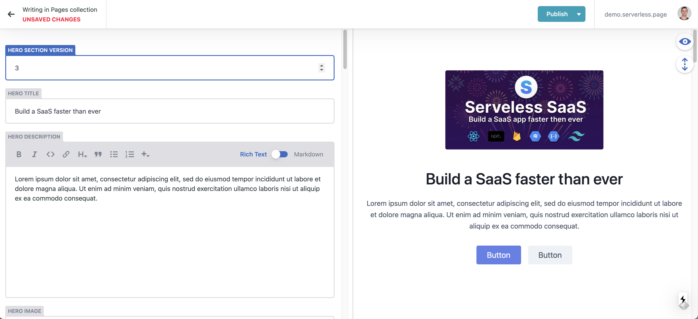

# NextWind - A flexible landing page & blog template

Made with [Next.js](https://nextjs.org/docs), [TypeScript](https://www.typescriptlang.org/), [Netlify CMS](https://www.netlifycms.org/), [Tailwind CSS](https://tailwindcss.com/) and [Tailblocks](https://mertjf.github.io/tailblocks/).

<div align="center">
    
</div>

## Getting Started

#### Netlify CMS

Netlify CMS is an open-source git-based content management library. Content is stored in your Git repository alongside your code for easier versioning, multi-channel publishing, and the option to handle content updates directly in Git. It's like a UI for editing your markdown files that we use to show the landing page and the blog posts.

- Create a new repository on [Github](https://github.com/)
- Open `cms/config.js` in this project and update `backend.repo` with your new repository name.
- Push the code of this project to this new repo.

You can now start the project with `yarn dev` or `npm run dev` and navigate to `/admin`. You can now login with Github and manage the content of the landing page of blog posts with a nice UI. When you make a change you can hit the "Publish" button, this will result in making a commit to your repository with the changes made to the corresponding markdown file.

Before deploying your application you need to enable basic GitHub authentication. Follow the authentication provider setup steps in the [Netlify docs](https://docs.netlify.com/visitor-access/oauth-provider-tokens/#setup-and-settings).

#### Test

You can use the `test-repo` backend to try out Netlify CMS without connecting to a Git repo. With this backend, you can write and publish content normally, but any changes will disappear when you reload the page.

Note: The test-repo backend can't access your local file system, nor does it connect to a Git repo, thus you won't see any existing files while using it.

To enable this backend, add the `test-repo` string to your `cms/config.js` file:

```
backend: {
    name: 'test-repo',
    ...
},
```

Note: It's recommended to connect your git repo with Vercel or Netlify for automatic deployments. When you hit the "publish" button inside the CMS, a commit will be made to your repo that includes the changes you made to the page. With automatic deployments activated this means a deployment will be triggered after you publish any changes. After this deployment, your changes will be live.

#### Deploy

Because Github requires a server for authentication, Netlify facilitates basic GitHub authentication.

To enable basic GitHub authentication follow the authentication provider setup steps in the [Netlify docs](https://docs.netlify.com/visitor-access/oauth-provider-tokens/#setup-and-settings).

---

## Need more features?

[Serverless SaaS](https://serverless.page) is a modern starter-kit that aims to be the perfect starting point for your next React app to build full-stack SaaS applications. Save time and skip implementing authentication, payments, teams, and more.

---

## Learn More

To learn more about Next.js, take a look at the following resources:

- [Next.js Documentation](https://nextjs.org/docs) - learn about Next.js features and API
- [Learn Next.js](https://nextjs.org/learn) - an interactive Next.js tutorial
- [Netlify CMS](https://www.netlifycms.org/) - learn about Netlify CMS
- [Tailwind CSS](https://tailwindcss.com/) - learn about Tailwind CSS
- [Tailblocks](https://mertjf.github.io/tailblocks/) - ready-to-use Tailwind CSS blocks
- [Serverless SaaS](https://serverless.page) - premium SaaS boilerplate
